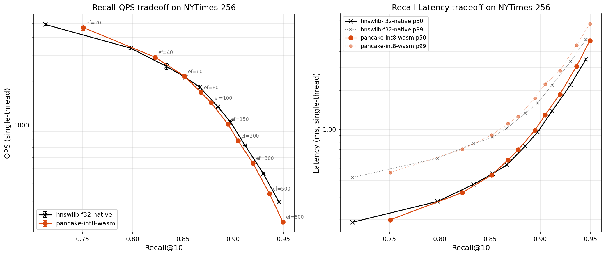
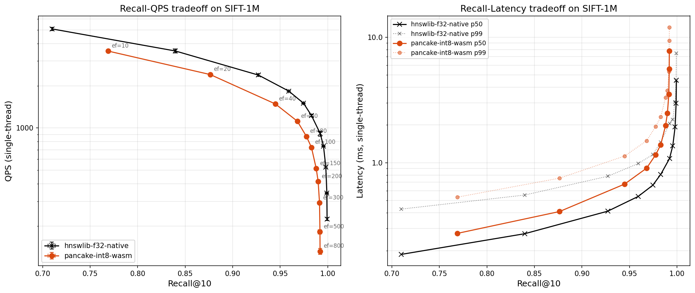

# Pancake

HNSW vector search in 98 KB of gzipped WebAssembly. Runs in Node.js, browsers, and Cloudflare Workers with no native dependencies.

Most ANN libraries ship as platform-specific native binaries, which means they don't work in edge runtimes, browser tabs, or any JavaScript environment without access to native extensions. Pancake is a single portable WASM module that runs wherever WebAssembly runs. The tradeoff is that it uses int8 quantization to keep memory footprint small, which costs a small amount of ranking precision at very high recall targets. Across the typical production recall range (85–95%), it performs comparably to native hnswlib on standard benchmarks.

Pancake is an ANN library — it doesn't ship an embedding model. Use any embedder that fits your use case (sentence-transformers, OpenAI, Cohere, etc.) and feed the resulting vectors to Pancake.

## Install

```bash
npm install pancake-wasm
```

## Runtime entry points

```js
// Node.js CJS
const Pancake = require('pancake-wasm');

// Node.js ESM
import Pancake from 'pancake-wasm';

// Browser, Cloudflare Workers, other V8 isolates
import Pancake from 'pancake-wasm/web';
```

## Quick start

```js
import Pancake from 'pancake-wasm';

const index = await Pancake.create({
  dim: 256,
  maxElements: 100000,
});

const id = index.add(new Float32Array(256));
index.addBatch([new Float32Array(256), new Float32Array(256)]);

const results = index.search(new Float32Array(256), 10);
// [{ id: 0, distance: 0.12 }, ...]

index.delete(id);
index.compact();

// Persist and restore
const snapshot = index.export();
const restored = await Pancake.create({ dim: 256, maxElements: 100000 });
restored.import(snapshot);
```

## API

### `await Pancake.create(opts)`

| Option | Type | Default | Description |
|--------|------|---------|-------------|
| `dim` | number | required | Input vector dimension |
| `maxElements` | number | `100000` | Pre-allocated capacity |
| `metric` | string | `'cosine'` | `'cosine'` or `'l2'` |
| `quantized` | boolean | `true` | Use int8 storage. Reduces memory ~4x with minimal recall loss. Set to `false` for exact float32 distances. |
| `M` | number | `16` | HNSW connectivity |
| `efConstruction` | number | `200` | Build-time beam width |
| `efSearch` | number | `100` | Query-time beam width |

### Methods

| Method | Returns | Description |
|--------|---------|-------------|
| `add(vector)` | `number` | Insert one vector; returns its ID |
| `addBatch(vectors)` | `number[]` | Insert multiple vectors |
| `search(query, k)` | `{id, distance}[]` | k-nearest-neighbor search |
| `delete(id)` | -- | Soft-delete by ID |
| `compact()` | -- | Rebuild graph without soft-deleted entries |
| `export()` | `Uint8Array` | Serialize index state |
| `import(data)` | -- | Restore a previous export |
| `dispose()` | -- | Free WASM buffers |

### Properties

| Property | Description |
|----------|-------------|
| `count` | Vectors stored (includes soft-deleted until `compact()`) |
| `ghostCount` | Soft-deleted vectors awaiting compaction |
| `ghostRatio` | `ghostCount / count` |
| `memory` | WASM heap bytes in use |
| `dim` | Vector dimension |

### Backend-specific limitations

Pancake routes to three internal implementations based on dimension:

- **1536D backend**: does not support `delete` or `compact`. Vectors are immutable once inserted. This affects OpenAI embeddings (which default to 1536D).
- **384D backend**: uses fixed internal HNSW parameters; `M`, `efConstruction`, and `efSearch` passed to `create()` are ignored.
- **Runtime-dimension backend** (all other dimensions): full API support, all parameters honored.

## Cloudflare Workers

Pancake was designed with edge workers in mind. The Worker *is* the vector search service — no external ANN backend, no database round-trip, no cold-start connection pool. The index runs in-process and serves queries at the edge.

The included Worker (`examples/worker/`) is a complete vector search HTTP API with optional bearer-token auth, per-IP rate limiting, and automatic persistence to Cloudflare R2.

### Endpoints

| Endpoint | Description |
|----------|-------------|
| `POST /init` | Create an index |
| `POST /add` | Insert a vector |
| `POST /add_batch` | Insert multiple vectors |
| `POST /delete` | Soft-delete by ID |
| `POST /compact` | Rebuild without deleted entries |
| `POST /search` | k-NN search |
| `GET /export` | Serialize to binary |
| `POST /import` | Restore from binary |
| `GET /stats` | Index count, memory, ghost ratio |

### Worker benchmark

Local `wrangler dev` against NYTimes-256 (30k vectors, 256D), full HTTP round-trip included:

| Metric | Value |
|--------|------:|
| Recall@10 | 80.9% |
| QPS | 204 |
| p50 latency | 4.6 ms |
| p99 latency | 11.0 ms |
| Memory | 10.4 MB |

Raw WASM search is significantly faster than this; the 4.6ms p50 includes request parsing, JSON serialization, and HTTP overhead. For comparison, calling a hosted vector DB from a Worker typically adds 30–100ms of network latency per search.

### Running locally

```bash
cd examples/worker
npx wrangler dev --port 8787
```

### Deploying

```bash
cd examples/worker
wrangler r2 bucket create pancake-indexes
wrangler deploy
```

See `examples/worker/wrangler.toml` for the full configuration. Key env vars: `API_KEY` (bearer auth), `ALLOWED_ORIGIN` (CORS), `RATE_LIMIT_RPM` (per-IP rate limit).

### Deployment notes

**Memory.** Workers have a 128 MB memory ceiling per isolate. Rough formula for quantized index memory:

```
~(dim + 8 + 7 × M) × num_vectors bytes
```

At M=16 this is `(dim + 120)` bytes per vector. Examples: 30k × 256D ≈ 10 MB, 200k × 384D ≈ 100 MB, 1M × 128D ≈ 256 MB. A 200k-vector 384D index is feasible but tight — leave headroom for request/response processing and WASM runtime overhead. A 300k-vector index at that dimension will OOM.

**CPU time.** Workers paid plan allows 50ms CPU per request (free tier: 10ms). Search (`/search`, `/add`, `/delete`, `/stats`, `/health`) comfortably fits within both tiers — the benchmark shows 4.6ms p50. Heavy operations (`/import`, `/compact`, `/add_batch` with large batches) can exceed free-tier limits on larger indexes. On the paid plan they're fine for indexes under ~100k vectors.

**Cold starts and R2 restore.** Workers isolates are not persistent — Cloudflare recycles them routinely. On cold start, the Worker fetches the index from R2 and deserializes it. This happens lazily on the first request and is cached in module scope for all subsequent requests in that isolate. For a large index, the first request after idle will be slow (1–2 seconds). Options: keep indexes small, accept slow first requests, or use Durable Objects for faster restore.

**Persistence.** The Worker debounces R2 writes with a 2-second timer and uses `ctx.waitUntil()` to complete writes after the response is sent. If the isolate is terminated before the timer fires, the last ~2 seconds of mutations may be lost. This is an inherent limitation of stateless isolates — there is no graceful shutdown hook. For workflows where every write must be durable, call `/export` explicitly after critical mutations.

**Rate limiting** is in-memory per-isolate. Each isolate tracks its own sliding-window counter, so the effective rate across multiple isolates is approximately `limit × number_of_isolates`. This is intentionally approximate — accurate global rate limiting requires KV or Durable Objects, which adds latency and complexity. For stricter enforcement, modify the Worker source or use Cloudflare's Rate Limiting product.

**CORS.** `ALLOWED_ORIGIN` is a single origin string (e.g. `https://example.com`), defaulting to `*`. For multi-origin setups, modify the Worker source to check against an array.

**Auth.** The optional `API_KEY` env var provides single-token bearer auth. This is sufficient for single-tenant deployments. For multi-tenant auth, integrate with your own auth system.

## Performance

Query throughput is comparable to native hnswlib across the typical production recall range. Build time is the main cost of running in WASM — plan to build once and query many times.

### NYTimes-256 (290k x 256D, cosine)

Matched parameters (M=16, efConstruction=200), same hardware, single-thread:



| ef_search | Pancake recall | Pancake QPS | hnswlib recall | hnswlib QPS |
|----------:|---------------:|------------:|---------------:|------------:|
| 20 | 75.1% | 4,666 | 71.3% | 4,894 |
| 100 | 87.8% | 1,420 | 86.7% | 1,821 |
| 200 | 90.5% | 779 | 89.7% | 1,047 |
| 500 | 93.6% | 338 | 93.0% | 462 |
| 800 | 94.9% | 216 | 94.5% | 296 |

For comparison, hnswlib-node installs at ~12 MB with a native binary; Pancake is 98 KB gzipped with no native dependencies.

The two curves track each other across the operating range. Pancake reaches slightly higher recall at the same `efSearch` because the runtime-dimension backend uses asymmetric distance computation: queries stay in float32 while stored vectors are dequantized on the fly. This preserves query-side precision, which is why recall holds up close to native float32.

### SIFT-1M (1M x 128D, Euclidean)

A harder workload at ten times the scale. Index memory (~256 MB) exceeds Cloudflare Workers' 128 MB limit, so this is a Node or browser deployment.



| ef_search | Pancake recall | Pancake QPS | hnswlib recall | hnswlib QPS |
|----------:|---------------:|------------:|---------------:|------------:|
| 40 | 94.5% | 1,484 | 92.7% | 2,384 |
| 100 | 98.3% | 727 | 98.3% | 1,227 |
| 200 | 99.0% | 415 | 99.6% | 743 |
| 500 | 99.2% | 182 | 99.9% | 344 |

Pancake's curve runs parallel to hnswlib's through the mid-recall range and diverges at very high recall. Above 97%, int8 quantization loses ranking precision relative to float32 — distinguishing very close neighbors requires more resolution than 8-bit scales provide. For applications targeting 85–95% recall (most production retrieval workloads), the gap is small. For near-exact retrieval, native hnswlib is the better choice.

Build times: Pancake 2,833s, hnswlib 1,356s on the same hardware. Both are offline costs for one-time indexing.

### Reproducing

Benchmark scripts are in the repo:

- `benchmark_nytimes.js` — NYTimes-256 direct WASM evaluation
- `benchmark_nytimes_worker.js` — NYTimes-256 end-to-end via the Worker HTTP API
- `benchmark_sift1m.js` — SIFT-1M
- `nytimes/qps-recall_sweep_hnswlib.js` — recall-QPS sweep vs hnswlib-node
- `qps-recall_sweep_sift1m.js` — recall-QPS sweep on SIFT-1M vs hnswlib-node
- `plot_sweep.py` — plot sweep CSV results

Results depend on dimension, corpus size, HNSW parameters, and hardware.

## When to use Pancake

Pancake makes sense when native ANN libraries aren't an option:

- **Edge workers** — the Worker *is* the search service; no separate vector database
- **Browser-based search** — client-side retrieval without a server round-trip
- **Portable applications** — one artifact, same behavior across every JavaScript runtime
- **Small to medium indexes** — in-process search without external infrastructure

If you have a server where native dependencies are fine, Faiss, hnswlib, or USearch will be faster — especially at very high recall targets. Pancake exists for the places those libraries can't go.

## How it works

### Quantization

Stored vectors use row-wise affine quantization. Each vector gets its own scale and offset derived from its own min/max:

```
scale  = (max - min) / 255
offset = min
q[i]   = uint8(clamp((x[i] - offset) / scale, 0, 255))
```

This preserves per-vector dynamic range better than global (per-tensor) quantization, at the cost of 8 bytes of overhead per vector for the scale and offset.

The runtime-dimension backend compares float32 queries against dequantized vectors (asymmetric distance). The 384D and 1536D template-specialized backends quantize the query once at search start and use int8-vs-int8 SIMD dot products (symmetric distance) for throughput.

### HNSW

Standard HNSW graph search. `M` controls graph connectivity, `efConstruction` controls build quality, `efSearch` controls query quality. Higher values improve recall at the cost of build or query speed.

## Examples

- `examples/worker/` — reference Cloudflare Worker with persistence, auth, and rate limiting
- `examples/cli/` — CLI pipeline for building an index from precomputed embeddings and searching (see [QUICKSTART.md](QUICKSTART.md))
- `examples/demo/technical_demo_cli.js` — interactive REPL exercising the full API against 5,000 precomputed 384D embeddings: recall validation, deletion, compaction, export/import, and adversarial stress tests
- `examples/demo/technical_demo_worker.js` — the same proof suite against a running Worker
- `examples/demo/test_worker.js` — synthetic 1536D Worker integration test (no external data required)
- `dist/technical-demo.html` — in-browser version of the proof suite

## Compatibility

- **Node.js** >= 16 (uses `WebAssembly`, `performance.now`)
- **Browsers**: any browser with [WebAssembly SIMD](https://caniuse.com/wasm-simd) (Chrome 91+, Firefox 89+, Safari 16.4+)
- **Cloudflare Workers**: tested with Wrangler >= 4.x; see `examples/worker/wrangler.toml` for the compatibility date
- **TypeScript**: type definitions included (`pancake.d.ts`)

## Building from source

The npm package ships prebuilt WASM artifacts. Rebuild only if you're modifying the C++ engine:

```bash
./build.sh
```

Requires an Emscripten toolchain with WASM SIMD support.

## License

Apache 2.0